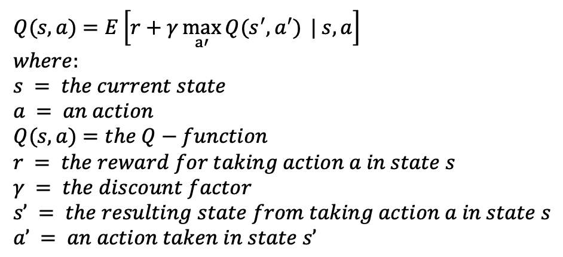
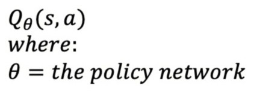
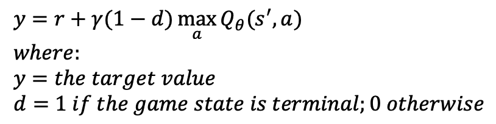
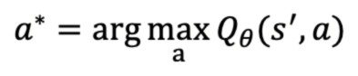
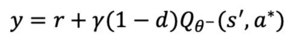

# Battlesnake 2
 
## Description:

The program implements a Double Deep Q-Network (DDQN) reinforcement learning algorithm for training a Battlesnake agent.  The DDQN algorithm is based on the DQN algorithm, which approximates the following Bellman optimality equation for determining the optimal quality of taking an action in a given a state:  

  

To approximate the Bellman optimality equation, the DQN algorithm uses a policy network to compute Q-values for each action in the action space, given a state.  This can be written as:

  

The algorithm then chooses the action corresponding to the highest Q-value for the agent, which the environment simulates to produce the next state, s’.  To find an optimal (target) value for the highest Q-value in the current state, the policy network calculates the highest Q-value in the next state, which is added to the reward for taking the current action in the current state as follows:

  

The DDQN algorithm differs from the above by using a target network in addition to a policy network.  The target network is a copy of the policy network, but it is updated less frequently.  For this program, it is updated once for every thousand policy network updates.  The target network helps to produce more consistent evaluations of future actions.  In the DDQN algorithm, the policy network finds the best action a* in the next state before the optimal value calculation as follows:

  

Then the target network is used to evaluate action a* to find the optimal value of Q(s, a), represented below as y:

  

The neural network uses the difference between optimal (target) values and Q-values to learn optimal actions, given any state.  
 
The program uses several features to enhance the DDQN algorithm, including a residual network, vectorized environments, prioritized experience replay, board canonicalization, self-play, and a Monte Carlo Tree Search (MCTS).  

The residual network consists of ten residual blocks, each of which has two convolution layers.  It takes a ten-channel state observation as input and outputs 3 Q-values and a state value.  The policy head of the network outputs 3 Q-values, since a Battlesnake can only survive by moving left, right, and forward.  The value head evaluates game states with a single value.  Together, the policy and value heads create a ‘dueling-head’ network architecture. 
 
Vectorized environments are used to run 8 simultaneous game simulations to improve the overall efficiency of the algorithm.  Prioritized experience replay is also used to train the agent on experiences in which it performed poorly and that provide the most opportunities for learning. 

The program uses self-play for training, wherein each simulation is played between the agent and 3 of the same opponent.  Every 5000 training steps, the opponent’s current policy becomes the agent’s policy, and every 10,000 steps, the opponent’s previous policy is added to a running pool of 20 policies.  At the beginning of each new game, an opponent policy is chosen. With an 80% probability, the agent’s policy is used as the opponent policy, and otherwise a policy from the opponent pool is randomly chosen as the opponent policy.  Occasionally training against old policies is intended to help the agent retain old strategies. 

The program also implements board canonicalization, which involves rotating the game state representation (observation) each turn so that the agent is moving towards the top of the board in every state processed by the network.  This reduces the total number of possible game states in the state space by generalizing the direction of the snake agent.  I have further generalized the game state by ‘flipping’ or reflecting the observation along the vertical axis with a 0.5 probability each turn before it is inputted into the network.  This generalizes the difference between moving left and right in the game.

A MCTS is used each turn during training to evaluate moves and improve the quality of experiences used for training the network.  The MCTS simulations use the same opponent policy as the game simulations. 

## Requirements:
 
To run the DDQN program, one requires Python 3 or higher, NumPy and PyTorch.  Run `python3 -m pip install numpy torch` to install the Python packages.

To use the agent for playing games, one requires: Python 3 or higher; Flask; an internet connection; and a public URL provider, such as ngrok. To install Flask, run the command `pip install Flask==2.3.2`. 
 
## How to run the program:
 
To run the DDQN program, open a command-line interface, navigate to the directory containing the program files, and run the command `python3 Training.py`. 

To use the agent in live games, first create a Battlesnake on play.battlesnake.com, then run the command `python3 Main.py` from the directory containing the program’s files.  Please see the Notes section of the Battlesnake 1 repository for instructions on how to obtain a server URL to create a Battlesnake.  
 
## Notes:

It may take a long time for the program to produce a well-trained agent. The number of MCTS simulations run per step and the hardware one uses will also affect the overall training time.

This program was tested on MacOS 15.7 with Clang.
